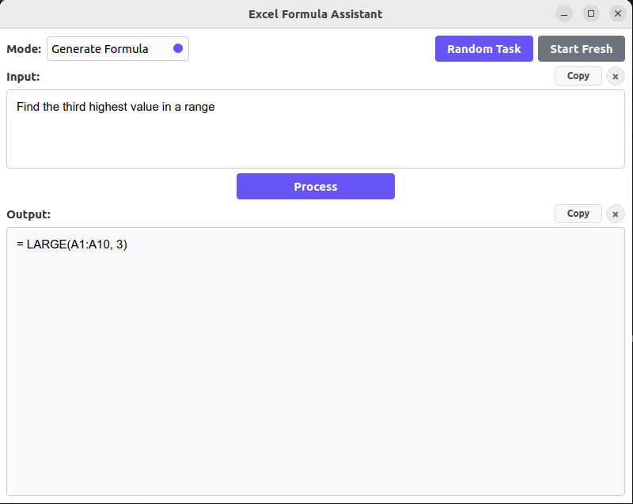

# Excel Formula Assistant

A desktop application that helps you generate and understand Excel formulas using OpenAI's GPT model.



## Features

- Generate Excel formulas by describing what you want to achieve
- Get detailed explanations of existing Excel formulas
- Simple and intuitive user interface

## Requirements

- Python 3.10 or higher
- PyQt6
- OpenAI Python package

## Installation

1. Clone this repository
2. Install the required packages:
   ```bash
   pip install -r requirements.txt
   ```
3. Set your OpenAI API key as an environment variable:
   ```bash
   export OPENAI_API_KEY='your-api-key-here'
   ```

## Usage

1. Run the application:
   ```bash
   python excel_formula_assistant.py
   ```
2. Select the mode (Generate Formula or Explain Formula)
3. Enter your request or formula in the input text box
4. Click "Process" to get the result

## Notes

- You must have a valid OpenAI API key to use this application
- The application uses GPT-4o-mini model for generating responses
